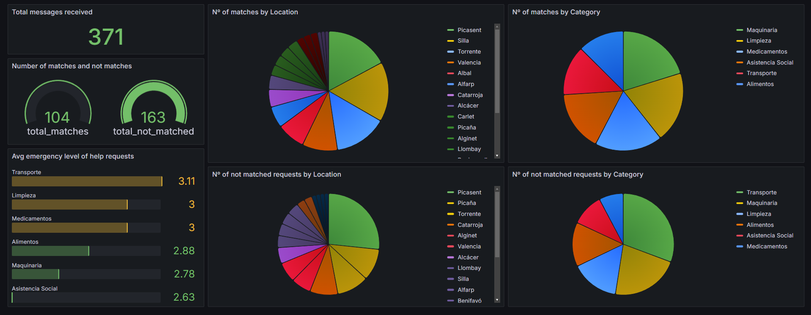

# **Proyecto de Ayuda DANA Valencia - README**

## 📋 **Descripción del Proyecto**
El objetivo de este proyecto es crear una plataforma que conecte a personas afectadas por la DANA de Valencia con voluntarios dispuestos a ayudar. La aplicación permite tanto solicitar como ofrecer ayuda mediante una interfaz sencilla desarrollada con Streamlit. Utiliza Google Cloud Platform como infraestructura principal para procesar, emparejar y almacenar los datos.

El sistema empareja automáticamente las solicitudes de ayuda con voluntarios cercanos basándose en la ubicación geográfica, categoría de ayuda y nivel de urgencia, optimizando así la distribución de recursos y acelerando el tiempo de respuesta.

Aunque este proyecto se diseñó inicialmente para asistir a las personas afectadas por la DANA en Valencia, su arquitectura en la nube permite su implementación y uso en cualquier parte del mundo, adaptándose a diversas situaciones de emergencia.

## ⚙️ **Funcionalidades Principales**
- **Solicitud de Ayuda**: Formulario para personas afectadas por la DANA
- **Oferta de Voluntariado**: Formulario para voluntarios que desean ayudar
- **Matching Automático**: Emparejamiento basado en ubicación, categoría y urgencia
- **Algoritmo de Distancia**: Cálculo mediante fórmula de Haversine para encontrar voluntarios cercanos
- **Procesamiento en Tiempo Real**: Pipeline de datos con Apache Beam en Dataflow
- **Almacenamiento de Datos**: Registro de solicitudes, voluntarios y emparejamientos en BigQuery
- **Visualización**: Dashboard en Grafana para seguimiento de métricas clave
- **Infraestructura como Código**: Despliegue automatizado con Terraform

## 🏗️ **Arquitectura del Sistema**


## 🔄 **Flujo de Datos**

1. El usuario rellena un formulario en la aplicación Streamlit (pedir_ayuda.py o ofrecer_ayuda.py)
2. Los datos se envían a Pub/Sub a través de temas específicos para ayuda y voluntarios
3. Dataflow (dataflow.py) procesa los mensajes utilizando Apache Beam:
   - Lee mensajes de las suscripciones de Pub/Sub
   - Agrupa los datos por categoría
   - Realiza el matching utilizando el algoritmo de distancia (haversine)
   - Envía los matches exitosos a BigQuery
   - Reintenta hasta 5 veces los mensajes no emparejados
   - Almacena en BigQuery los mensajes que no pudieron ser emparejados después de 5 intentos
4. Los resultados se almacenan en BigQuery en diferentes tablas:
   - matched_pairs: Emparejamientos exitosos
   - unmatched_requests: Solicitudes de ayuda no emparejadas
   - unmatched_volunteers: Ofertas de voluntarios no emparejadas
5. Grafana se conecta a BigQuery para mostrar dashboards actualizados

## 🧮 **Algoritmo de Matching**

El sistema utiliza el algoritmo de Haversine para calcular la distancia entre solicitantes y voluntarios. El proceso es:

1. Se ordenan las solicitudes de ayuda por nivel de urgencia (de mayor a menor)
2. Para cada solicitud, se busca el voluntario más cercano dentro de su radio de disponibilidad
3. Se crea un emparejamiento cuando se encuentra un voluntario adecuado
4. Los voluntarios ya emparejados no están disponibles para otras solicitudes en ese ciclo

## 🛠️ **Requisitos Previos**
1. Python 3.8+
2. Cuenta de Google Cloud Platform con facturación habilitada
3. Google Cloud SDK instalado y configurado
4. Terraform (para despliegue de infraestructura)

## 🚀 **Cómo Ejecutar el Proyecto**

### 1. Clonar el repositorio

```bash
git clone https://github.com/joel1091/Data-Project-2.git
cd Data-Project-2
```

### 2. Iniciar sesión Google Cloud CLI

```
gcloud auth login
gcloud config set project dataproject2425
gcloud config set compute/region europe-west1
```

### 3. Desplegar infraestructura con Terraform

```bash
cd terraform
terraform init
terraform plan
terraform apply
```

### 4. Acceder a Streamlit
Para poder enviar mensajes manualmente, accede a streamlit ejecutando el siguiente comando:
```
gcloud run services list --platform managed --region europe-west1
```
Ahora haz click en el link que te proporciona el service `Streamlit`

## 📁 **Archivos Clave**

| Archivo | Descripción |
|---------|-------------|
| terraform/main.tf | Configuración principal de la infraestructura |
| Dataflow/dataflow.py | Pipeline de procesamiento de datos |
| Streamlit/app.py | Plataforma para solicitar o pedir ayuda |
| app/automatic/main.py | Generador automático de voluntarios y necesitados |


## 📊 **Tablas en BigQuery**

### matched_pairs
- match_id (STRING): Identificador único del emparejamiento
- categoria (STRING): Categoría de ayuda
- distance (FLOAT): Distancia en km entre solicitante y voluntario
- urgencia (INTEGER): Nivel de urgencia de la solicitud
- help_* (varios campos): Información del solicitante
- volunteer_* (varios campos): Información del voluntario

### unmatched_requests
- id (STRING): Identificador único de la solicitud
- nombre, ubicacion, poblacion, categoria, descripcion (STRING)
- created_at (TIMESTAMP): Fecha de creación
- nivel_urgencia (INTEGER): Prioridad de la solicitud
- telefono (STRING): Contacto del solicitante
- attempts (INTEGER): Número de intentos de emparejamiento
- insertion_stamp (TIMESTAMP): Fecha de inserción en BigQuery

### unmatched_volunteers
- id (STRING): Identificador único del voluntario
- nombre, ubicacion, poblacion, categoria (STRING)
- radio_disponible_km (INTEGER): Distancia máxima que puede cubrir
- created_at (TIMESTAMP): Fecha de creación
- attempts (INTEGER): Número de intentos de emparejamiento
- insertion_stamp (TIMESTAMP): Fecha de inserción en BigQuery

## 📊 **Monitorización**

El proyecto incluye un dashboard en Grafana que muestra:
- Número total de mensajes recibidos.
- Número total de matches realizados.
- Categorías más solicitadas/ofrecidas.
- Número de matches por localización y por categoría.
- úmero de peticiones sin coincidencia por localización y categoría.

### Para acceder a Grafana, sigue los siguientes pasos:
1. Ejecuta este comando y accede al link proporcionado (Service: Grafana)
```bash
gcloud run services list --platform managed --region europe-west1
```
2. Inicia sesión: 
               <br>
               User: `admin` 
               <br>
               Password: `dataproject2`

3. Añade el conector en `Connections` > `Add new connection`

4. Selecciona `Google BigQuery` y haz click en `Install`
   
5. Haz click en `Add new data source` 
   
6. Selecciona abajo `GCE Default Service Account` y escriba el nombre del proyecto `dataproject2425`
   
7. Dirígete a `Dashboards` 
   
8. Haz click en `New` y en `Import` 
   
9.  Importa el archivo json: [dashboard-grafana.json](Grafana/dashboard-grafana.json)
    
10. Selecciona `Google BigQuery data source`

</br>



## 🔧 **Tecnologías Utilizadas**

| Tecnología | Uso |
|------------|-----|
| Google Cloud Platform | Infraestructura en la nube |
| Pub/Sub | Mensajería en tiempo real |
| Dataflow | Procesamiento de datos |
| BigQuery | Almacenamiento y análisis de datos |
| Grafana | Visualización y monitoreo |
| Streamlit | Interfaz de usuario |
| Apache Beam | Framework de procesamiento |
| Terraform | Infraestructura como código |
| Docker | Contenerización |
| Python | Lenguaje de programación |

## 🎥 Demostración en Video

[Accede desde aquí al video de la demostración de la app](https://youtu.be/FMXI984ecq0) 

```bash
https://youtu.be/FMXI984ecq0
```

## 🤝 **Contribuciones**

Para contribuir:
1. Crea una nueva rama (`git checkout -b feature/amazing-feature`)
2. Realiza tus cambios
3. Haz commit de tus cambios (`git commit -m 'Add some amazing feature'`)
4. Push a la rama (`git push origin feature/amazing-feature`)
5. Abre un Pull Request

## 📄 **Licencia**

Este proyecto está bajo la Licencia MIT. Ver el archivo `LICENSE` para más detalles.

## 📞 **Proyecto hecho por Ting, Joel y Alejandro**

Ting - [Github](https://github.com/e-wach)
 | Joel - [GitHub](https://github.com/joel1091)
 | Alejandro - [Github](https://github.com/Alejbc27) 


Link del proyecto: [https://github.com/joel1091/Data-Project-2](https://github.com/joel1091/Data-Project-2)

